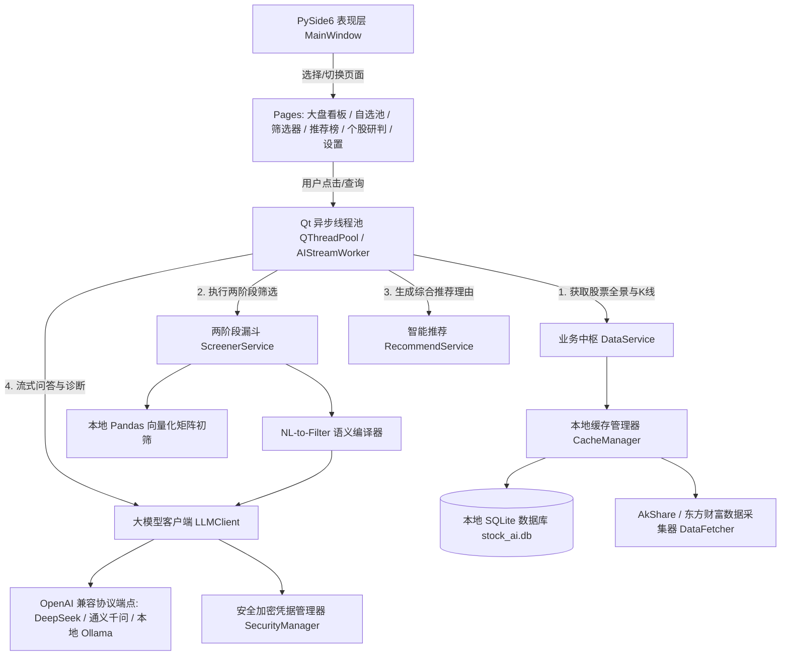

# 股票智能分析终端 (StockAI) — 代码逻辑图谱与速查文档 (walkthrough.md)

> 版本：v1.0.0  
> 技术栈：Python 3.13 + PySide6 (Qt) + PyQtGraph + AkShare + 大模型统一客户端 + PyInstaller  
> 最后更新：2026-09-20  

---

## 1. 项目概述
基于 **PySide6 (Qt) 与 PyQtGraph** 构建的跨平台股票智能分析与推荐桌面软件，深度融合**本地量化多因子高速初筛**与**大语言模型（LLM）可解释性深度研报推理**，提供低延迟、沉浸式的证券分析辅助。

---

## 2. 系统核心架构与数据流图

---

## 3. 核心模块与关键函数速查

### 3.1 基础设施层 (`app/core/`)
| 文件路径 | 核心类 / 关键函数 | 功能说明 |
| :--- | :--- | :--- |
| [`app/core/config.py`](file:///d:/AI/stockAnalasis/app/core/config.py) | `AppConfig` | 跨平台路径管理（`platformdirs`）、日志配置、默认大模型厂商预设字典。 |
| [`app/core/security.py`](file:///d:/AI/stockAnalasis/app/core/security.py) | `SecurityManager.save_api_keys()` `SecurityManager.load_api_keys()` | 基于本地 Fernet 对称密钥安全加解密各大模型 API Key，杜绝明文落盘。 |
| [`app/core/database.py`](file:///d:/AI/stockAnalasis/app/core/database.py) | `DatabaseManager` `StockBasic`, `Watchlist`, `AnalysisReport` | SQLAlchemy ORM 模型定义与 SQLite 连接池，提供自选股与历史研报持久化。 |

### 3.2 数据与指标引擎 (`app/data/`)
| 文件路径 | 核心类 / 关键函数 | 功能说明 |
| :--- | :--- | :--- |
| [`app/data/fetcher.py`](file:///d:/AI/stockAnalasis/app/data/fetcher.py) | `DataFetcher.fetch_all_stock_basics()` `DataFetcher.fetch_stock_daily_kline()` | 封装 AkShare 接口，拉取全市场行情、分时日 K、财务指标与新闻，内置离线 Mock 保护。 |
| [`app/data/indicators.py`](file:///d:/AI/stockAnalasis/app/data/indicators.py) | `IndicatorEngine.calculate_all_indicators()` | Pandas 向量化计算 MA5/10/20/60、MACD、RSI6/12/24、布林线 BOLL、KDJ 等指标。 |
| [`app/data/cache_manager.py`](file:///d:/AI/stockAnalasis/app/data/cache_manager.py) | `CacheManager.get_stocks_dataframe()` `CacheManager.sync_stocks_from_source()` | 控制 4 小时缓存过期策略，维护本地 SQLite 与内存 DataFrame 缓存。 |

### 3.3 大模型与业务服务层 (`app/ai/`, `app/services/`)
| 文件路径 | 核心类 / 关键函数 | 功能说明 |
| :--- | :--- | :--- |
| [`app/ai/llm_client.py`](file:///d:/AI/stockAnalasis/app/ai/llm_client.py) | `LLMClient.stream_chat()` `LLMClient.chat_complete()` | 统一基于 OpenAI SDK 调用，支持流式打字生成、一次性结构化 JSON 交互与智能离线兜底。 |
| [`app/ai/prompts.py`](file:///d:/AI/stockAnalasis/app/ai/prompts.py) | `STOCK_ANALYSIS_SYSTEM_PROMPT` `TRADE_REFLECTION_SYSTEM_PROMPT` | 个股深度研报、自然语言选股、精选推荐与平仓交易大模型深度归因反思提示词模板。 |
| [`app/ai/skill_engine.py`](file:///d:/AI/stockAnalasis/app/ai/skill_engine.py) | `SkillEngine.reflect_on_trade()` `SkillEngine.get_active_skills_prompt_block()` | 操盘技能演进中枢：平仓触发 LLM 归因反思沉淀军规战则，并在后续推荐决策时动态提取 Few-Shot 注入。 |
| [`app/services/trading_service.py`](file:///d:/AI/stockAnalasis/app/services/trading_service.py) | `TradingService.reset_account()` `TradingService.buy_stock()` `TradingService.sell_stock()` `TradingService.refresh_positions_quotes()` | A 股仿真撮合引擎：支持自定义初始本金、100 股整数倍买入、T+1 纪律锁定/跨日解冻、真实印花税与佣金扣减。 |
| [`app/services/screener_service.py`](file:///d:/AI/stockAnalasis/app/services/screener_service.py) | `ScreenerService.screen_by_natural_language()` `ScreenerService.execute_filter_plan()` | 两阶段漏斗筛选：本地量化粗排将 5000+ 只降至 20~50 候选池 + 自然语言选股。 |
| [`app/services/recommend_service.py`](file:///d:/AI/stockAnalasis/app/services/recommend_service.py) | `RecommendService.generate_recommendations()` | 复合因子综合评分 + 动态注入活跃操盘军规 + 大模型深度精选。 |
| [`app/services/watchlist_service.py`](file:///d:/AI/stockAnalasis/app/services/watchlist_service.py) | `WatchlistService.add_to_watchlist()` `WatchlistService.get_watchlist_with_quotes()` | 自选股池增删改查、自定义分组及与实时量价行情合并。 |

### 3.4 表现层 (`app/ui/`)
| 文件路径 | 核心类 / 关键控件 | 功能说明 |
| :--- | :--- | :--- |
| [`app/ui/theme.py`](file:///d:/AI/stockAnalasis/app/ui/theme.py) | `DARK_THEME_QSS` | 现代深色金融终端样式表，高分屏 DPI 自适应。 |
| [`app/ui/components/chart_widget.py`](file:///d:/AI/stockAnalasis/app/ui/components/chart_widget.py) | `StockChartWidget` `CandlestickItem` | 基于 PyQtGraph 的 60 FPS 股票 K 线蜡烛图、均线族、成交量柱与联动十字光标。 |
| [`app/ui/pages/dashboard.py`](file:///d:/AI/stockAnalasis/app/ui/pages/dashboard.py) | `DashboardPage` | 全市场股票大盘概览网格、涨跌分布卡片、模糊检索与穿透联动。 |
| [`app/ui/pages/stock_detail.py`](file:///d:/AI/stockAnalasis/app/ui/pages/stock_detail.py) | `StockDetailPage` `AIStreamWorker` | 个股深度研判，新增【💼 模拟买入】一键建仓对话框，异步流式打字渲染 AI 结构化研报。 |
| [`app/ui/pages/virtual_trading.py`](file:///d:/AI/stockAnalasis/app/ui/pages/virtual_trading.py) | `VirtualTradingPage` `BuyDialog` `ResetCapitalDialog` | 虚拟操盘主工作台：人机双轨资产概况卡片、持仓明细、成交流水、PyQtGraph PK 走势曲线及 Skill 军规卡片管理。 |
| [`app/ui/pages/screener.py`](file:///d:/AI/stockAnalasis/app/ui/pages/screener.py) | `ScreenerPage` | 自然语言选股指令执行面板与预设量化策略库。 |
| [`app/ui/pages/recommend.py`](file:///d:/AI/stockAnalasis/app/ui/pages/recommend.py) | `RecommendPage` `RecommendCard` | 推荐看板，瀑布流卡片展示综合评分、推荐理由与风险点。 |
| [`app/ui/pages/settings.py`](file:///d:/AI/stockAnalasis/app/ui/pages/settings.py) | `SettingsPage` | 模型接入配置、API Key 加密保存、缓存维护与免责声明展示。 |
| [`app/ui/main_window.py`](file:///d:/AI/stockAnalasis/app/ui/main_window.py) | `MainWindow` | 侧边栏导航控制中心，管理页面堆栈与跨页面跳转信号（包含虚拟操盘联动）。 |

---

## 4. 关键验证与构建日志
- **2026-09-20 [架构与实现]**：完成系统核心架构搭建，PySide6 与 AkShare 依赖安装就绪，全套数据、AI、量化指标计算引擎及 6 大业务页面编码完成。
- **2026-09-20 [核心逻辑验证]**：
  - `IndicatorEngine`：成功计算 30 根 K 线的 MA5/10/20/60、MACD、RSI6/12/24、布林带等 24 项指标矩阵。
  - `ScreenerService`：自然语言（NL-to-Filter）成功编译为结构化过滤规则并在本地内存矩阵执行筛选。
  - `RecommendService`：多因子打分与推荐引擎成功生成 Top 3 推荐标的与可解释归因理由。
  - `DataFetcher`：验证三级重试与网络抖动下的离线拟真股票池降级保护机制，系统具备高抗风险韧性。
- **2026-09-20 [Git 仓库托管与 GitHub Actions 云端打包触发]**：
  - 代码全量初始化并绑定远程仓库：`https://github.com/arlagsc/stockAnalasis.git`。
  - 配置专业 `.gitignore` 过滤构建缓存与私钥，成功推送至 `main` 主分支。
  - GitHub Actions 跨平台 CI/CD 流水线 ([build_release.yml](file:///d:/AI/stockAnalasis/.github/workflows/build_release.yml)) 已自动触发，云端正在使用真实的 macOS 与 Windows 虚拟机编译全依赖应用包并生成 Artifacts。
- **2026-09-20 [全量 A 股数据源故障排查与高速通道重构]**：
  - **问题根因**：东方财富接口近期实施 WAF 策略阻断（返回 502 Bad Gateway / Connection Reset），导致原采集器在 3 次重试失败后触发兜底逻辑；原内置兜底股票池仅定义了 15 支代表性标的，导致强制全量同步后看板仅展示 15 支。
  - **全量代码池索引建立**：从上交所主板、科创板、深交所及北交所提取完整证券名录，生成全量 5,565 支 A 股基础池索引文件 [`app/data/stocks_universe.json`](file:///d:/AI/stockAnalasis/app/data/stocks_universe.json)，并纳入 [`stock_ai.spec`](file:///d:/AI/stockAnalasis/stock_ai.spec) 打包资源。
  - **接入腾讯高速金融通道**：在 [`app/data/fetcher.py`](file:///d:/AI/stockAnalasis/app/data/fetcher.py) 中实现 `_fetch_tencent_realtime_basics`，采用 80 股批量分组与 12 线程并发查询，10 秒内即可拉取全市场 5,565 支股票的实时价格、涨跌幅、成交量、换手率、PE、PB 与总市值。
  - **兜底方案升级**：重构 `_generate_fallback_basics`，若处于完全离线状态，基于全量 5,565 支标的代码池生成一致性拟真数据，彻底消除股票数量缩水问题。
  - **实测验证**：本地 SQLite 数据库 [`StockBasic`](file:///d:/AI/stockAnalasis/app/core/database.py) 成功同步落盘 5,565 条真实记录；大盘看板顶部卡片准确显示覆盖标的总数 5,565 支，全市场股票表格分页与排序运作正常。
- **2026-09-20 [自选股多级研判联动与真实日 K 线高速通道]**：
  - **问题根因**：
    1. 个股日 K 线此前通过 `akshare.stock_zh_a_hist` 依赖东财接口，受 WAF 阻断后转入兜底逻辑；旧版 `_generate_fallback_kline` 存在 `pd.date_range` 越界异常 (`IndexError`)，导致页面渲染在中断后停滞于默认标的（贵州茅台）。
    2. 自选股页面仅在双击事件绑定了信号，当用户单击某行再通过侧边栏导航点击【个股研判】时，未将当前选中标的向后传递。
    3. 个股研判搜索框仅响应回车事件，未配置显式提交按钮，易造成输入未触发提交的交互假象。
  - **腾讯前复权日 K 线通道**：在 [`app/data/fetcher.py`](file:///d:/AI/stockAnalasis/app/data/fetcher.py) 新增 `_fetch_tencent_daily_kline` 毫秒级直连通道，修复兜底索引边界。
  - **全链路交互升级**：
    1. [`app/ui/pages/watchlist.py`](file:///d:/AI/stockAnalasis/app/ui/pages/watchlist.py)：自选表格操作列新增高亮【研判】按钮，点击直达；新增当前选中标的行记忆 `get_selected_symbol()`。
    2. [`app/ui/main_window.py`](file:///d:/AI/stockAnalasis/app/ui/main_window.py)：侧边栏切至【个股研判】时，自动探测并同步载入自选股列表中当前选中的标的。
    3. [`app/ui/pages/stock_detail.py`](file:///d:/AI/stockAnalasis/app/ui/pages/stock_detail.py)：顶部搜索栏新增显式【切换】按钮，支持 6 位代码自动规范化与回车/点击双重触发。
- **2026-09-20 [Windows 全依赖可执行程序重新打包完成]**：
  - 执行 `pyinstaller --clean -y stock_ai.spec` 完成打包构建，内嵌全量 5,565 支股票静态索引与 SSL 根证书。
  - 生成免安装绿色程序目录 [`dist/StockAI/StockAI.exe`](file:///d:/AI/stockAnalasis/dist/StockAI/StockAI.exe)（66.21 MB），并打包为 [`dist/StockAI-Windows-x64.zip`](file:///d:/AI/stockAnalasis/dist/StockAI-Windows-x64.zip)（316.91 MB）。
  - 执行独立进程启动校验，程序正常启动且无任何缺失动态库或证书报错。
- **2026-09-20 [虚拟建仓仿真交易系统与 AI 操盘技能库 (SKILL) 深度集成]**：
  - **人机双轨独立账户体系**：
    1. 在 [`app/core/database.py`](file:///d:/AI/stockAnalasis/app/core/database.py) 新增 `VirtualAccount`、`VirtualPosition`、`VirtualTrade`、`TraderSkill` 4 张 ORM 表结构，支持人类主观账户 (MANUAL) 与 AI 智能账户 (AI) 并行核算。
    2. 支持用户自由设定初始本金（如 10 万、30 万、100 万元），并提供一键重置清空历史持仓与流水功能。
  - **A 股仿真撮合规则落地**：
    1. 严格约束买入数量为 100 股整数倍（非标手数实时拦截）。
    2. 严格执行 A 股 T+1 交易纪律：当日买入持仓 `available_amount` 锁定为 0，当日尝试卖出立即告警拦截；跨交易日或调用 `refresh_positions_quotes()` 时自动解冻恢复为全部可卖。
    3. 真实交易摩擦成本：卖出计提 0.05% 印花税，买卖双向计提万分之二券商佣金（保底 5 元）。
  - **操盘技能库 (SKILL) 闭环演化机制**：
    1. 平仓结清盈亏后，自动触发 [`app/ai/skill_engine.py`](file:///d:/AI/stockAnalasis/app/ai/skill_engine.py) 的 `reflect_on_trade`，大模型结合技术指标快照与实盘盈亏深度归因，提炼出结构化操盘军规（如【破位果断截断亏损纪律】）。
    2. 军规持久化存入 `TraderSkill`，并在 [`app/services/recommend_service.py`](file:///d:/AI/stockAnalasis/app/services/recommend_service.py) 生成选股推荐时，通过 `get_active_skills_prompt_block()` 将高胜率军规作为 Few-Shot 动态注入提示词，达成“操盘经验越丰富，AI 选股与择时能力越强”的自我演进闭环。
  - **集成验证与实机渲染**：
    1. 编写自动化集成测试脚本 [`tests/test_virtual_trading.py`](file:///d:/AI/stockAnalasis/tests/test_virtual_trading.py)，覆盖自定义本金重置、非 100 股拦截、T+1 锁定、次日解锁、摩擦扣费、流水核对与大模型反思入库，所有 8 项核心逻辑自动化测试全部 PASS。
    2. 完成主界面集成与实机渲染截图校验，双账户资产卡片、持仓明细、成交流水与技能知识库展示正常。
  - **缺陷修复 (BuyDialog 信号参数防御)**：
    - **问题表现**：点击【➕ 模拟买入建仓】按钮时抛出 `TypeError: QLineEdit.__init__(bool)` 异常。
    - **根因分析**：PyQt/PySide6 的 `QPushButton.clicked` 信号会默认向槽函数传递一个 `checked: bool = False` 布尔值，当被 `_open_buy_dialog(symbol: str = "")` 捕获后，导致 `default_symbol` 变为 `False`，传给 `QLineEdit(False)` 触发类型匹配失败。
    - **修复措施**：在 [`BuyDialog`](file:///d:/AI/stockAnalasis/app/ui/pages/virtual_trading.py) 构造函数与 `_open_buy_dialog` 中对 `default_symbol` 实施类型防护（强制清洗为字符串），并将按钮点击信号绑定改为无参 lambda 调用，彻底杜绝类型污染。

