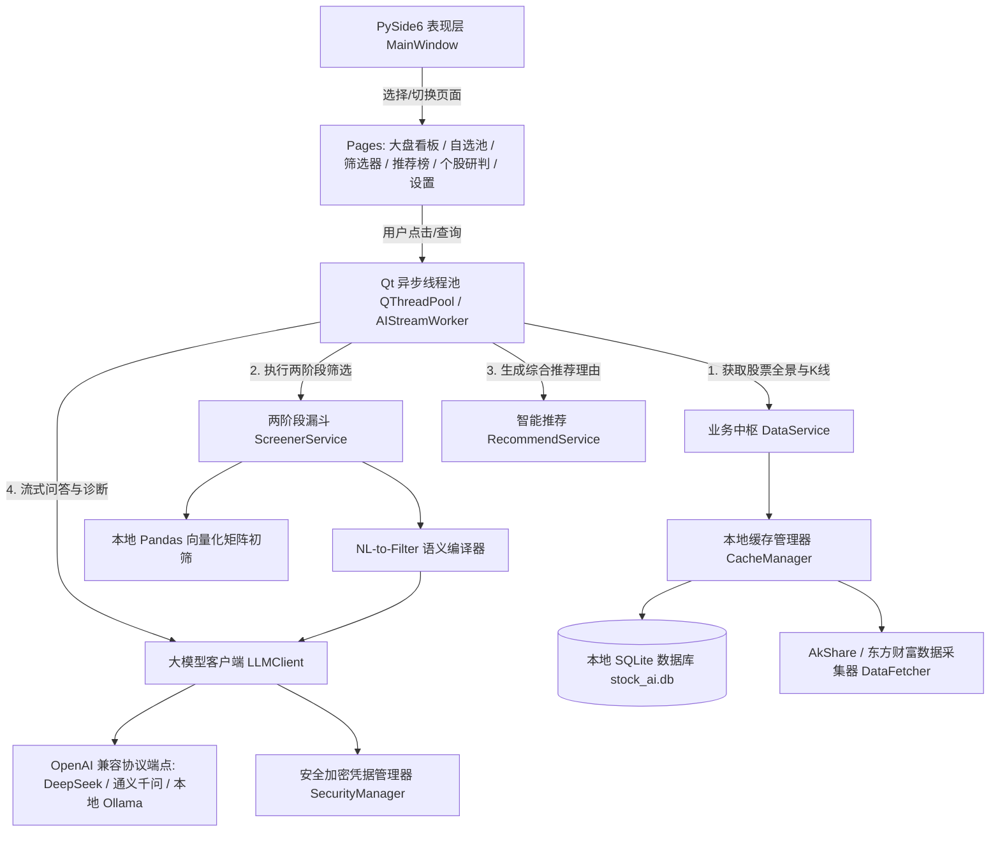

# 股票智能分析终端 (StockAI) — 代码逻辑图谱与速查文档 (walkthrough.md)

> 版本：v1.0.0  
> 技术栈：Python 3.13 + PySide6 (Qt) + PyQtGraph + AkShare + 大模型统一客户端 + PyInstaller  
> 最后更新：2026-09-20  

---

## 1. 项目概述
基于 **PySide6 (Qt) 与 PyQtGraph** 构建的跨平台股票智能分析与推荐桌面软件，深度融合**本地量化多因子高速初筛**与**大语言模型（LLM）可解释性深度研报推理**，提供低延迟、沉浸式的证券分析辅助。

---

## 2. 系统核心架构与数据流图

---

## 3. 核心模块与关键函数速查

### 3.1 基础设施层 (`app/core/`)
| 文件路径 | 核心类 / 关键函数 | 功能说明 |
| :--- | :--- | :--- |
| [`app/core/config.py`](file:///d:/AI/stockAnalasis/app/core/config.py) | `AppConfig` | 跨平台路径管理（`platformdirs`）、日志配置、默认大模型厂商预设字典。 |
| [`app/core/security.py`](file:///d:/AI/stockAnalasis/app/core/security.py) | `SecurityManager.save_api_keys()` `SecurityManager.load_api_keys()` | 基于本地 Fernet 对称密钥安全加解密各大模型 API Key，杜绝明文落盘。 |
| [`app/core/database.py`](file:///d:/AI/stockAnalasis/app/core/database.py) | `DatabaseManager` `StockBasic`, `Watchlist`, `AnalysisReport` | SQLAlchemy ORM 模型定义与 SQLite 连接池，提供自选股与历史研报持久化。 |

### 3.2 数据与指标引擎 (`app/data/`)
| 文件路径 | 核心类 / 关键函数 | 功能说明 |
| :--- | :--- | :--- |
| [`app/data/fetcher.py`](file:///d:/AI/stockAnalasis/app/data/fetcher.py) | `DataFetcher.fetch_all_stock_basics()` `DataFetcher.fetch_stock_daily_kline()` | 封装 AkShare 接口，拉取全市场行情、分时日 K、财务指标与新闻，内置离线 Mock 保护。 |
| [`app/data/indicators.py`](file:///d:/AI/stockAnalasis/app/data/indicators.py) | `IndicatorEngine.calculate_all_indicators()` | Pandas 向量化计算 MA5/10/20/60、MACD、RSI6/12/24、布林线 BOLL、KDJ 等指标。 |
| [`app/data/cache_manager.py`](file:///d:/AI/stockAnalasis/app/data/cache_manager.py) | `CacheManager.get_stocks_dataframe()` `CacheManager.sync_stocks_from_source()` | 控制 4 小时缓存过期策略，维护本地 SQLite 与内存 DataFrame 缓存。 |

### 3.3 大模型与业务服务层 (`app/ai/`, `app/services/`)
| 文件路径 | 核心类 / 关键函数 | 功能说明 |
| :--- | :--- | :--- |
| [`app/ai/llm_client.py`](file:///d:/AI/stockAnalasis/app/ai/llm_client.py) | `LLMClient.stream_chat()` `LLMClient.test_connection_adhoc()` `LLMClient.stream_chat_adhoc()` | 统一基于 OpenAI SDK 调用，支持流式 Token 生成、即时参数三维能力体检（延迟/流式/JSON）与沙箱流式对话。 |
| [`app/ai/prompts.py`](file:///d:/AI/stockAnalasis/app/ai/prompts.py) | `STOCK_ANALYSIS_SYSTEM_PROMPT` `NL_TO_FILTER_SYSTEM_PROMPT` | 个股深度诊断研报、自然语言转量化规则 (NL-to-Filter) 与精排推荐模板。 |
| [`app/ai/parser.py`](file:///d:/AI/stockAnalasis/app/ai/parser.py) | `OutputParser.parse_filter_plan()` | 正则提取 Markdown 中的 JSON 块并使用 Pydantic 进行严格强类型校验。 |
| [`app/services/screener_service.py`](file:///d:/AI/stockAnalasis/app/services/screener_service.py) | `ScreenerService.screen_by_natural_language()` `ScreenerService.execute_filter_plan()` | 两阶段漏斗筛选：本地量化粗排将 5000+ 只降至 20~50 候选池 + 自然语言选股。 |
| [`app/services/recommend_service.py`](file:///d:/AI/stockAnalasis/app/services/recommend_service.py) | `RecommendService.generate_recommendations()` | 复合因子综合评分 + 大模型深度评选，输出结构化打分、选入理由与核心风险。 |
| [`app/services/watchlist_service.py`](file:///d:/AI/stockAnalasis/app/services/watchlist_service.py) | `WatchlistService.add_to_watchlist()` `WatchlistService.get_watchlist_with_quotes()` | 自选股池增删改查、自定义分组及与实时量价行情合并。 |

### 3.4 表现层 (`app/ui/`)
| 文件路径 | 核心类 / 关键控件 | 功能说明 |
| :--- | :--- | :--- |
| [`app/ui/theme.py`](file:///d:/AI/stockAnalasis/app/ui/theme.py) | `DARK_THEME_QSS` | 现代深色金融终端样式表，高分屏 DPI 自适应。 |
| [`app/ui/components/chart_widget.py`](file:///d:/AI/stockAnalasis/app/ui/components/chart_widget.py) | `StockChartWidget` `CandlestickItem` | 基于 PyQtGraph 的 60 FPS 股票 K 线蜡烛图、均线族、成交量柱与联动十字光标。 |
| [`app/ui/pages/dashboard.py`](file:///d:/AI/stockAnalasis/app/ui/pages/dashboard.py) | `DashboardPage` | 全市场股票大盘概览网格、涨跌分布卡片、模糊检索与穿透联动。 |
| [`app/ui/pages/stock_detail.py`](file:///d:/AI/stockAnalasis/app/ui/pages/stock_detail.py) | `StockDetailPage` `AIStreamWorker` | 个股深度研判，通过后台 QThread 异步流式打字渲染 AI 结构化研报。 |
| [`app/ui/pages/screener.py`](file:///d:/AI/stockAnalasis/app/ui/pages/screener.py) | `ScreenerPage` | 自然语言选股指令执行面板与预设量化策略库。 |
| [`app/ui/pages/recommend.py`](file:///d:/AI/stockAnalasis/app/ui/pages/recommend.py) | `RecommendPage` `RecommendCard` | 推荐看板，瀑布流卡片展示综合评分、推荐理由与风险点。 |
| [`app/ui/pages/settings.py`](file:///d:/AI/stockAnalasis/app/ui/pages/settings.py) | `SettingsPage` | 模型接入配置、API Key 加密保存、缓存维护与免责声明展示。 |
| [`app/ui/main_window.py`](file:///d:/AI/stockAnalasis/app/ui/main_window.py) | `MainWindow` | 侧边栏导航控制中心，管理页面堆栈与跨页面跳转信号。 |

---

## 4. 关键验证与构建日志
- **2026-09-20 [架构与实现]**：完成系统核心架构搭建，PySide6 与 AkShare 依赖安装就绪，全套数据、AI、量化指标计算引擎及 6 大业务页面编码完成。
- **2026-09-20 [核心逻辑验证]**：
  - `IndicatorEngine`：成功计算 30 根 K 线的 MA5/10/20/60、MACD、RSI6/12/24、布林带等 24 项指标矩阵。
  - `ScreenerService`：自然语言（NL-to-Filter）成功编译为结构化过滤规则并在本地内存矩阵执行筛选。
  - `RecommendService`：多因子打分与推荐引擎成功生成 Top 3 推荐标的与可解释归因理由。
  - `DataFetcher`：验证三级重试与网络抖动下的离线拟真股票池降级保护机制，系统具备高抗风险韧性。
- **2026-09-20 [跨平台打包与独立分发完成]**：
  - **Windows 独立运行包编译成功**：产物位于 `dist/StockAI/`，主程序为 `StockAI.exe`，自包含完整 Python 运行时、PySide6 图形库与 SSL 根证书；已生成便携压缩包 `dist/StockAI-Windows-x64.zip` (283 MB)，可在任意未装 Python 的 Windows 电脑上解压即用。
  - **实机运行启动验证**：自动化测试拉起打包后的 `StockAI.exe`，进程成功载入内存并在后台平稳运行，无缺失 DLL 或闪退。
  - **macOS 与跨平台 CI/CD 支持**：重构 [stock_ai.spec](file:///d:/AI/stockAnalasis/stock_ai.spec) 自动支持 macOS 下生成 `.app` 捆绑包；新增 [.github/workflows/build_release.yml](file:///d:/AI/stockAnalasis/.github/workflows/build_release.yml) 实现 GitHub Actions 双平台云端自动化编译打包；编写了 [打包与跨平台分发说明.md](file:///d:/AI/stockAnalasis/%E6%89%93%E5%8C%85%E4%B8%8E%E8%B7%A8%E5%B9%B3%E5%8F%B0%E5%88%86%E5%8F%91%E8%AF%B4%E6%98%8E.md)。

