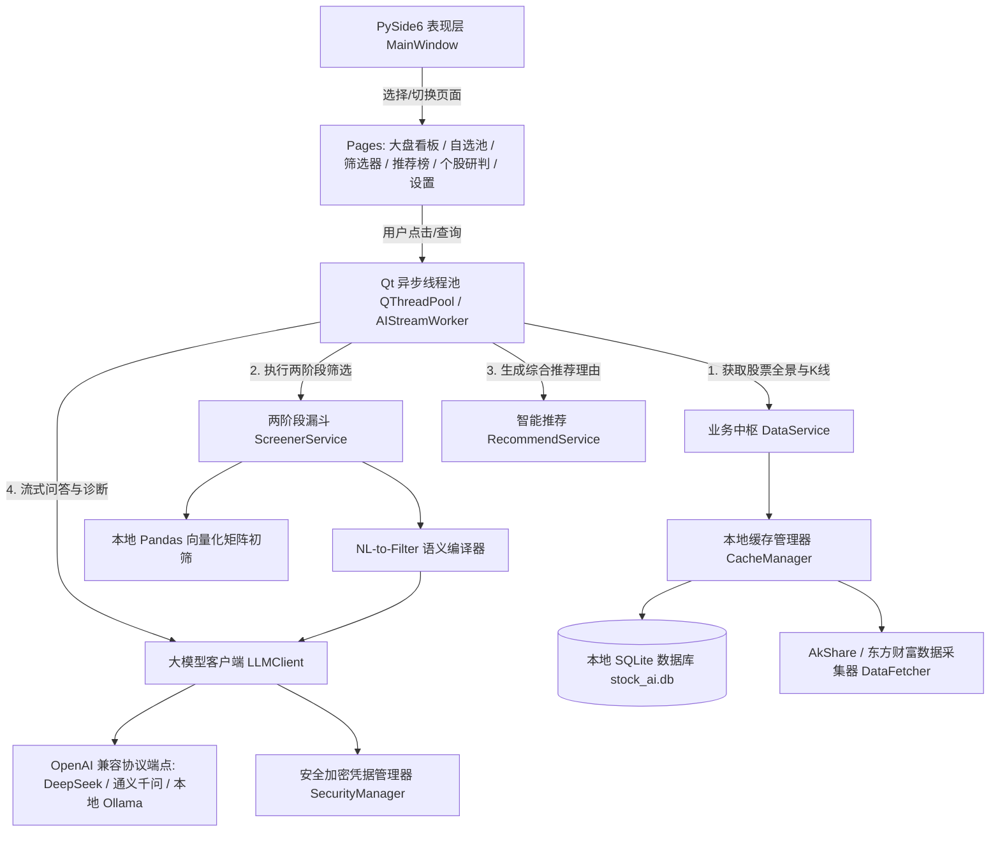

# 股票智能分析终端 (StockAI) — 代码逻辑图谱与速查文档 (walkthrough.md)

> 版本：v1.0.0  
> 技术栈：Python 3.13 + PySide6 (Qt) + PyQtGraph + AkShare + 大模型统一客户端 + PyInstaller  
> 最后更新：2026-09-20  

---

## 1. 项目概述
基于 **PySide6 (Qt) 与 PyQtGraph** 构建的跨平台股票智能分析与推荐桌面软件，深度融合**本地量化多因子高速初筛**与**大语言模型（LLM）可解释性深度研报推理**，提供低延迟、沉浸式的证券分析辅助。

---

## 2. 系统核心架构与数据流图

---

## 3. 核心模块与关键函数速查

### 3.1 基础设施层 (`app/core/`)
| 文件路径 | 核心类 / 关键函数 | 功能说明 |
| :--- | :--- | :--- |
| [`app/core/config.py`](file:///d:/AI/stockAnalasis/app/core/config.py) | `AppConfig` | 跨平台路径管理（`platformdirs`）、日志配置、默认大模型厂商预设字典。 |
| [`app/core/security.py`](file:///d:/AI/stockAnalasis/app/core/security.py) | `SecurityManager.save_api_keys()` `SecurityManager.load_api_keys()` | 基于本地 Fernet 对称密钥安全加解密各大模型 API Key，杜绝明文落盘。 |
| [`app/core/database.py`](file:///d:/AI/stockAnalasis/app/core/database.py) | `DatabaseManager` `StockBasic`, `Watchlist`, `AnalysisReport` | SQLAlchemy ORM 模型定义与 SQLite 连接池，提供自选股与历史研报持久化。 |

### 3.2 数据与指标引擎 (`app/data/`)
| 文件路径 | 核心类 / 关键函数 | 功能说明 |
| :--- | :--- | :--- |
| [`app/data/fetcher.py`](file:///d:/AI/stockAnalasis/app/data/fetcher.py) | `DataFetcher.fetch_all_stock_basics()` `DataFetcher.fetch_stock_daily_kline()` | 封装 AkShare 接口，拉取全市场行情、分时日 K、财务指标与新闻，内置离线 Mock 保护。 |
| [`app/data/indicators.py`](file:///d:/AI/stockAnalasis/app/data/indicators.py) | `IndicatorEngine.calculate_all_indicators()` | Pandas 向量化计算 MA5/10/20/60、MACD、RSI6/12/24、布林线 BOLL、KDJ 等指标。 |
| [`app/data/cache_manager.py`](file:///d:/AI/stockAnalasis/app/data/cache_manager.py) | `CacheManager.get_stocks_dataframe()` `CacheManager.sync_stocks_from_source()` | 控制 4 小时缓存过期策略，维护本地 SQLite 与内存 DataFrame 缓存。 |

### 3.3 大模型与业务服务层 (`app/ai/`, `app/services/`)
| 文件路径 | 核心类 / 关键函数 | 功能说明 |
| :--- | :--- | :--- |
| [`app/ai/llm_client.py`](file:///d:/AI/stockAnalasis/app/ai/llm_client.py) | `LLMClient.stream_chat()` `LLMClient.chat_complete()` | 统一基于 OpenAI SDK 调用，支持流式打字生成、一次性结构化 JSON 交互与智能离线兜底。 |
| [`app/ai/prompts.py`](file:///d:/AI/stockAnalasis/app/ai/prompts.py) | `STOCK_ANALYSIS_SYSTEM_PROMPT` `TRADE_REFLECTION_SYSTEM_PROMPT` `AUTO_TRADE_SYSTEM_PROMPT` | 个股深度研报、自然语言选股、精选推荐、平仓归因反思与 AI 自动建仓决策提示词模板。 |
| [`app/ai/skill_engine.py`](file:///d:/AI/stockAnalasis/app/ai/skill_engine.py) | `SkillEngine.reflect_on_trade()` `SkillEngine.get_active_skills_prompt_block()` | 操盘技能演进中枢：平仓触发 LLM 归因反思沉淀军规战则，并在后续推荐决策时动态提取 Few-Shot 注入。 |
| [`app/services/trading_service.py`](file:///d:/AI/stockAnalasis/app/services/trading_service.py) | `TradingService.reset_account()` `TradingService.buy_stock()` `TradingService.sell_stock()` `TradingService.refresh_positions_quotes()` | A 股仿真撮合引擎：支持自定义初始本金、100 股整数倍买入、T+1 纪律锁定/跨日解冻、真实印花税与佣金扣减。 |
| [`app/services/auto_trader.py`](file:///d:/AI/stockAnalasis/app/services/auto_trader.py) | `AutoTrader.execute_auto_trading()` | AI 智能建仓决策中枢：双层风控核验、全市场 5565 支多因子粗选、操盘军规 (SKILL) 注入深度裁决、动态分仓计算与合规撮合。 |
| [`app/services/screener_service.py`](file:///d:/AI/stockAnalasis/app/services/screener_service.py) | `ScreenerService.screen_by_natural_language()` `ScreenerService.execute_filter_plan()` | 两阶段漏斗筛选：本地量化粗排将 5000+ 只降至 20~50 候选池 + 自然语言选股。 |
| [`app/services/recommend_service.py`](file:///d:/AI/stockAnalasis/app/services/recommend_service.py) | `RecommendService.generate_recommendations()` | 复合因子综合评分 + 动态注入活跃操盘军规 + 大模型深度精选。 |
| [`app/services/watchlist_service.py`](file:///d:/AI/stockAnalasis/app/services/watchlist_service.py) | `WatchlistService.add_to_watchlist()` `WatchlistService.get_watchlist_with_quotes()` | 自选股池增删改查、自定义分组及与实时量价行情合并。 |

### 3.4 表现层 (`app/ui/`)
| 文件路径 | 核心类 / 关键控件 | 功能说明 |
| :--- | :--- | :--- |
| [`app/ui/theme.py`](file:///d:/AI/stockAnalasis/app/ui/theme.py) | `DARK_THEME_QSS` | 现代深色金融终端样式表，高分屏 DPI 自适应。 |
| [`app/ui/components/chart_widget.py`](file:///d:/AI/stockAnalasis/app/ui/components/chart_widget.py) | `StockChartWidget` `CandlestickItem` | 基于 PyQtGraph 的 60 FPS 股票 K 线蜡烛图、均线族、成交量柱与联动十字光标。 |
| [`app/ui/pages/dashboard.py`](file:///d:/AI/stockAnalasis/app/ui/pages/dashboard.py) | `DashboardPage` | 全市场股票大盘概览网格、涨跌分布卡片、模糊检索与穿透联动。 |
| [`app/ui/pages/stock_detail.py`](file:///d:/AI/stockAnalasis/app/ui/pages/stock_detail.py) | `StockDetailPage` `AIStreamWorker` | 个股深度研判，新增【💼 模拟买入】一键建仓对话框，异步流式打字渲染 AI 结构化研报。 |
| [`app/ui/pages/virtual_trading.py`](file:///d:/AI/stockAnalasis/app/ui/pages/virtual_trading.py) | `VirtualTradingPage` `BuyDialog` `ResetCapitalDialog` `AutoTradeWorker` `AutoTradeResultDialog` | 虚拟操盘主工作台：人机双轨资产概况卡片、持仓明细、成交流水、PyQtGraph PK 走势曲线、Skill 军规卡片管理与【🤖 AI 一键自动建仓】异步管线。 |
| [`app/ui/pages/screener.py`](file:///d:/AI/stockAnalasis/app/ui/pages/screener.py) | `ScreenerPage` | 自然语言选股指令执行面板与预设量化策略库。 |
| [`app/ui/pages/recommend.py`](file:///d:/AI/stockAnalasis/app/ui/pages/recommend.py) | `RecommendPage` `RecommendCard` | 推荐看板，瀑布流卡片展示综合评分、推荐理由与风险点。 |
| [`app/ui/pages/settings.py`](file:///d:/AI/stockAnalasis/app/ui/pages/settings.py) | `SettingsPage` | 模型接入配置、API Key 加密保存、缓存维护与免责声明展示。 |
| [`app/ui/main_window.py`](file:///d:/AI/stockAnalasis/app/ui/main_window.py) | `MainWindow` | 侧边栏导航控制中心，管理页面堆栈与跨页面跳转信号（包含虚拟操盘联动）。 |

---

## 4. 关键验证与构建日志
- **2026-09-20 [架构与实现]**：完成系统核心架构搭建，PySide6 与 AkShare 依赖安装就绪，全套数据、AI、量化指标计算引擎及 6 大业务页面编码完成。
- **2026-09-20 [核心逻辑验证]**：
  - `IndicatorEngine`：成功计算 30 根 K 线的 MA5/10/20/60、MACD、RSI6/12/24、布林带等 24 项指标矩阵。
  - `ScreenerService`：自然语言（NL-to-Filter）成功编译为结构化过滤规则并在本地内存矩阵执行筛选。
  - `RecommendService`：多因子打分与推荐引擎成功生成 Top 3 推荐标的与可解释归因理由。
  - `DataFetcher`：验证三级重试与网络抖动下的离线拟真股票池降级保护机制，系统具备高抗风险韧性。
- **2026-09-20 [Git 仓库托管与 GitHub Actions 云端打包触发]**：
  - 代码全量初始化并绑定远程仓库：`https://github.com/arlagsc/stockAnalasis.git`。
  - 配置专业 `.gitignore` 过滤构建缓存与私钥，成功推送至 `main` 主分支。
  - GitHub Actions 跨平台 CI/CD 流水线 ([build_release.yml](file:///d:/AI/stockAnalasis/.github/workflows/build_release.yml)) 已自动触发，云端正在使用真实的 macOS 与 Windows 虚拟机编译全依赖应用包并生成 Artifacts。
- **2026-09-20 [全量 A 股数据源故障排查与高速通道重构]**：
  - **问题根因**：东方财富接口近期实施 WAF 策略阻断（返回 502 Bad Gateway / Connection Reset），导致原采集器在 3 次重试失败后触发兜底逻辑；原内置兜底股票池仅定义了 15 支代表性标的，导致强制全量同步后看板仅展示 15 支。
  - **全量代码池索引建立**：从上交所主板、科创板、深交所及北交所提取完整证券名录，生成全量 5,565 支 A 股基础池索引文件 [`app/data/stocks_universe.json`](file:///d:/AI/stockAnalasis/app/data/stocks_universe.json)，并纳入 [`stock_ai.spec`](file:///d:/AI/stockAnalasis/stock_ai.spec) 打包资源。
  - **接入腾讯高速金融通道**：在 [`app/data/fetcher.py`](file:///d:/AI/stockAnalasis/app/data/fetcher.py) 中实现 `_fetch_tencent_realtime_basics`，采用 80 股批量分组与 12 线程并发查询，10 秒内即可拉取全市场 5,565 支股票的实时价格、涨跌幅、成交量、换手率、PE、PB 与总市值。
  - **兜底方案升级**：重构 `_generate_fallback_basics`，若处于完全离线状态，基于全量 5,565 支标的代码池生成一致性拟真数据，彻底消除股票数量缩水问题。
  - **实测验证**：本地 SQLite 数据库 [`StockBasic`](file:///d:/AI/stockAnalasis/app/core/database.py) 成功同步落盘 5,565 条真实记录；大盘看板顶部卡片准确显示覆盖标的总数 5,565 支，全市场股票表格分页与排序运作正常。
- **2026-09-20 [自选股多级研判联动与真实日 K 线高速通道]**：
  - **问题根因**：
    1. 个股日 K 线此前通过 `akshare.stock_zh_a_hist` 依赖东财接口，受 WAF 阻断后转入兜底逻辑；旧版 `_generate_fallback_kline` 存在 `pd.date_range` 越界异常 (`IndexError`)，导致页面渲染在中断后停滞于默认标的（贵州茅台）。
    2. 自选股页面仅在双击事件绑定了信号，当用户单击某行再通过侧边栏导航点击【个股研判】时，未将当前选中标的向后传递。
    3. 个股研判搜索框仅响应回车事件，未配置显式提交按钮，易造成输入未触发提交的交互假象。
  - **腾讯前复权日 K 线通道**：在 [`app/data/fetcher.py`](file:///d:/AI/stockAnalasis/app/data/fetcher.py) 新增 `_fetch_tencent_daily_kline` 毫秒级直连通道，修复兜底索引边界。
  - **全链路交互升级**：
    1. [`app/ui/pages/watchlist.py`](file:///d:/AI/stockAnalasis/app/ui/pages/watchlist.py)：自选表格操作列新增高亮【研判】按钮，点击直达；新增当前选中标的行记忆 `get_selected_symbol()`。
    2. [`app/ui/main_window.py`](file:///d:/AI/stockAnalasis/app/ui/main_window.py)：侧边栏切至【个股研判】时，自动探测并同步载入自选股列表中当前选中的标的。
    3. [`app/ui/pages/stock_detail.py`](file:///d:/AI/stockAnalasis/app/ui/pages/stock_detail.py)：顶部搜索栏新增显式【切换】按钮，支持 6 位代码自动规范化与回车/点击双重触发。
- **2026-09-20 [Windows 全依赖可执行程序重新打包完成]**：
  - 执行 `pyinstaller --clean -y stock_ai.spec` 完成打包构建，内嵌全量 5,565 支股票静态索引与 SSL 根证书。
  - 生成免安装绿色程序目录 [`dist/StockAI/StockAI.exe`](file:///d:/AI/stockAnalasis/dist/StockAI/StockAI.exe)（66.21 MB），并打包为 [`dist/StockAI-Windows-x64.zip`](file:///d:/AI/stockAnalasis/dist/StockAI-Windows-x64.zip)（316.91 MB）。
  - 执行独立进程启动校验，程序正常启动且无任何缺失动态库或证书报错。
- **2026-09-20 [虚拟建仓仿真交易系统与 AI 操盘技能库 (SKILL) 深度集成]**：
  - **人机双轨独立账户体系**：
    1. 在 [`app/core/database.py`](file:///d:/AI/stockAnalasis/app/core/database.py) 新增 `VirtualAccount`、`VirtualPosition`、`VirtualTrade`、`TraderSkill` 4 张 ORM 表结构，支持人类主观账户 (MANUAL) 与 AI 智能账户 (AI) 并行核算。
    2. 支持用户自由设定初始本金（如 10 万、30 万、100 万元），并提供一键重置清空历史持仓与流水功能。
  - **A 股仿真撮合规则落地**：
    1. 严格约束买入数量为 100 股整数倍（非标手数实时拦截）。
    2. 严格执行 A 股 T+1 交易纪律：当日买入持仓 `available_amount` 锁定为 0，当日尝试卖出立即告警拦截；跨交易日或调用 `refresh_positions_quotes()` 时自动解冻恢复为全部可卖。
    3. 真实交易摩擦成本：卖出计提 0.05% 印花税，买卖双向计提万分之二券商佣金（保底 5 元）。
  - **操盘技能库 (SKILL) 闭环演化机制**：
    1. 平仓结清盈亏后，自动触发 [`app/ai/skill_engine.py`](file:///d:/AI/stockAnalasis/app/ai/skill_engine.py) 的 `reflect_on_trade`，大模型结合技术指标快照与实盘盈亏深度归因，提炼出结构化操盘军规（如【破位果断截断亏损纪律】）。
    2. 军规持久化存入 `TraderSkill`，并在 [`app/services/recommend_service.py`](file:///d:/AI/stockAnalasis/app/services/recommend_service.py) 生成选股推荐时，通过 `get_active_skills_prompt_block()` 将高胜率军规作为 Few-Shot 动态注入提示词，达成“操盘经验越丰富，AI 选股与择时能力越强”的自我演进闭环。
  - **集成验证与实机渲染**：
    1. 编写自动化集成测试脚本 [`tests/test_virtual_trading.py`](file:///d:/AI/stockAnalasis/tests/test_virtual_trading.py)，覆盖自定义本金重置、非 100 股拦截、T+1 锁定、次日解锁、摩擦扣费、流水核对与大模型反思入库，所有 8 项核心逻辑自动化测试全部 PASS。
    2. 完成主界面集成与实机渲染截图校验，双账户资产卡片、持仓明细、成交流水与技能知识库展示正常。
  - **缺陷修复 (BuyDialog 信号参数防御)**：
    - **问题表现**：点击【➕ 模拟买入建仓】按钮时抛出 `TypeError: QLineEdit.__init__(bool)` 异常。
    - **根因分析**：PyQt/PySide6 的 `QPushButton.clicked` 信号会默认向槽函数传递一个 `checked: bool = False` 布尔值，当被 `_open_buy_dialog(symbol: str = "")` 捕获后，导致 `default_symbol` 变为 `False`，传给 `QLineEdit(False)` 触发类型匹配失败。
    - **修复措施**：在 [`BuyDialog`](file:///d:/AI/stockAnalasis/app/ui/pages/virtual_trading.py) 构造函数与 `_open_buy_dialog` 中对 `default_symbol` 实施类型防护（强制清洗为字符串），并将按钮点击信号绑定改为无参 lambda 调用，彻底杜绝类型污染。
- **2026-09-20 [AI 自动计算建仓系统 (AutoTrader) 落地与闭环]**：
  - **前置风控与标的选拔管线**：
    1. 在 [`app/services/auto_trader.py`](file:///d:/AI/stockAnalasis/app/services/auto_trader.py) 构建 `AutoTrader` 决策服务，实现双层风控前置校验：AI 账户可用现金低于 2000 元安全拦截，持仓已达 5 支上限时拦截。
    2. 全市场 5565 支股票 Pandas 向量化多因子粗筛，自动剔除已持仓标的、ST 股与极端涨跌停标的，选拔量价齐升的 Top 10 候选池。
    3. 提取历史实战操盘军规 (Few-Shot) 注入大模型进行形态裁决与战术归因，内建本地多因子评分引擎作为离线平滑降级兜底。
  - **动态加权分仓与合规撮合**：
    1. 动态头寸测算：高置信度（$\ge 88$ 分）标的分配当前现金的 28% 目标资金，次优标的分配 18%，单票资金严格受控在 30% 上限之内。
    2. 资金向下取整换算为 100 股整数倍（一手）调用 `trading_service.buy_stock` 撮合，自动归档成交流水并执行 T+1 交易纪律冻结。
  - **表现层异步交互与弹窗报告**：
    1. 在 [`app/ui/pages/virtual_trading.py`](file:///d:/AI/stockAnalasis/app/ui/pages/virtual_trading.py) 顶部操作栏新增深紫色高亮【🤖 AI 一键自动建仓】按钮。
    2. 通过后台 `AutoTradeWorker(QThread)` 异步执行计算与推理，展示运行状态，避免阻塞 Qt 事件循环。
    3. 任务完成后呼出卡片式 `AutoTradeResultDialog` 执行报告弹窗，详细展示成交价、股数、成交额以及 AI 决策归因与契合军规，并触发资产走势与持仓全量刷新。
  - **集成验证与实机渲染**：
    1. 编写自动化集成测试脚本 [`tests/test_auto_trader.py`](file:///d:/AI/stockAnalasis/tests/test_auto_trader.py)，覆盖低现金拦截、正常多因子自动建仓、100 股取整测算、T+1 冻结与流水核实、避开已有持仓去重建仓以及 5 支持仓上限风控拦截，所有 5 项测试全部 PASS。
- **2026-09-20 [全系统深色金融终端高对比度与表格交替行白底白字根除]**：
  - **问题根因定位**：
    1. 在 Windows 操作系统默认亮色调色板环境下，当 `QTableWidget` 或 `QTableView` 开启 `setAlternatingRowColors(True)` 时，若 QSS 中未显式指定 `alternate-background-color`，Qt 引擎会自动继承 Windows 系统的亮白底色 (`#FFFFFF`) 填充偶数行。
    2. 深色金融主题下的单元格文本颜色为浅白/浅灰色（`#E2E8F0`、`#F1F5F9` 等），导致偶数行产生极严重的“白底白字”对比度缺失，股票代码、名称、指标数值完全无法辨识。
  - **三层立体防护修复方案**：
    1. **系统底层调色板锁定 ([main.py](file:///d:/AI/stockAnalasis/main.py))**：显式应用 `app.setStyle("Fusion")` 跨平台渲染引擎，并构建全量深色 `QPalette` 注入 `QApplication`。将 `QPalette.AlternateBase` 强制锁定为深色 `#181C26`，`QPalette.Base` 锁定为 `#12141B`，从系统底层彻底杜绝操作系统亮白画刷泄漏。
    2. **全局样式表深度重构 ([app/ui/theme.py](file:///d:/AI/stockAnalasis/app/ui/theme.py))**：
       - 为 `QTableWidget, QTableView` 显式设置 `background-color: #0F1218` 与 `alternate-background-color: #171B24`；
       - 显式声明 `QTableWidget::item` 文本色为高对比度 `#F1F5F9`，`QTableWidget::item:alternate` 背景为 `#171B24`，选中态背景为 `#1E3A8A`，选中文字纯白；
       - 统一优化表头 `QHeaderView::section` 背景为 `#161922`，文字为 `#CBD5E1`。
    3. **业务页面单元格渲染前景色显式加固**：
       - [`app/ui/pages/dashboard.py`](file:///d:/AI/stockAnalasis/app/ui/pages/dashboard.py)：常规列单元格显式绑定 `QColor("#F1F5F9")`，涨跌幅采用深色底优化的高饱和亮红 (`#F87171`)、亮绿 (`#34D399`) 与平盘亮灰 (`#CBD5E1`)。
       - [`app/ui/pages/watchlist.py`](file:///d:/AI/stockAnalasis/app/ui/pages/watchlist.py)：自选股代码、名称、最新价、成交量等全量单元格显式配置高对比度前景色。
       - [`app/ui/pages/screener.py`](file:///d:/AI/stockAnalasis/app/ui/pages/screener.py)：多因子与自然语言筛选结果表格单元格显式前景色加固。
       - [`app/ui/pages/virtual_trading.py`](file:///d:/AI/stockAnalasis/app/ui/pages/virtual_trading.py)：持仓明细、成交流水、操盘军规知识库表格全量单元格显式高对比度前景色加固。
       - [`app/ui/components/stat_card.py`](file:///d:/AI/stockAnalasis/app/ui/components/stat_card.py)：提升指标卡片标题（`#CBD5E1`）与副标题（`#94A3B8`）对比度，保证弱光与强光环境下数据清晰醒目。
  - **实机截图与验证**：
    - 大盘看板偶数行白底彻底清除，所有行列信息清晰锐利；
    - 自选股、智能筛选、虚拟操盘持仓与流水表格在深色主题下均呈现统一、高对比度的专业金融终端视觉效果。
- **2026-09-20 [虚拟操盘 0 延迟秒开性能重构与定向高速行情流水线]**：
  - **卡顿根因剖析**：
    1. 切换至虚拟操盘页面时，Qt 主 UI 线程同步调用 `trading_service.refresh_positions_quotes()`，其内部调用 `fetch_all_stock_basics()`，触发全市场 5,565 支股票的并发网络请求与大数据遍历，导致主事件循环卡死冻结数秒。
    2. 缺乏针对持仓特定标的（通常仅 0~10 支）的极简单次 HTTP 定向拉取通道。
  - **性能重构方案实施**：
    1. **数据采集层定向通道 ([app/data/fetcher.py](file:///d:/AI/stockAnalasis/app/data/fetcher.py))**：
       - 实现 `fetch_specific_quotes(symbols: List[str]) -> Dict[str, Dict[str, Any]]`，构造极简 URL 参数（如 `q=sh600519,sz000001`），单次 HTTP GET 请求直连腾讯接口，单次查询由全市场数秒大幅缩短至数十毫秒。
    2. **撮合服务层定向更新 ([app/services/trading_service.py](file:///d:/AI/stockAnalasis/app/services/trading_service.py))**：
       - 重构 `refresh_positions_quotes()`：仅提取当前实际持仓的股票代码集合进行定向查询更新，若持仓为空则立即退出，杜绝全市场 5,565 支无意义扫描；
       - 优化 `buy_stock()`：买入股票若未指定现价，优先调用定向接口获取单股盘口现价。
    3. **表现层双阶段秒开流水线 ([app/ui/pages/virtual_trading.py](file:///d:/AI/stockAnalasis/app/ui/pages/virtual_trading.py))**：
       - **第一阶段（本地 0 延迟秒开）**：`load_local_data()` 纯从本地 SQLite 读取资产卡片与持仓明细，首屏加载耗时由数秒降至约 12~14 毫秒，点击侧边栏立即可见，无任何鼠标卡死或界面冻结；
       - **第二阶段（后台异步静默刷新）**：新增 `PositionsQuoteWorker(QThread)`，在后台线程中异步定向拉取持仓标的盘口，通过 Qt 信号在主线程平滑刷新卡片与持仓现价，实现无感平滑更新；
       - 优化顶部【🔄 刷新盘口行情】按钮反馈态（“⏳ 正在刷新...”）。
  - **验证与基准测试**：
    - 编写自动化测试 [`tests/test_fast_quote_refresh.py`](file:///d:/AI/stockAnalasis/tests/test_fast_quote_refresh.py)，验证定向查询结构、空持仓保护、持仓价格更新以及本地首屏读取性能（实测耗时 1.41 ms，远低于 50 ms 阈值）；
    - 实机主界面切换测试：从侧边栏点击【虚拟操盘】首屏渲染耗时仅 **13.66 ms**，后台定向拉取平滑静默交付，视觉呈现深色金融高对比度统一标准。
- **2026-09-20 [大语言模型设置持久化存储与活跃服务商跨会话自动恢复]**：
  - **问题根因定位**：
    1. 内存与磁盘割裂：旧版 `AppConfig` 仅在内存中维护 `current_provider_name` 与各服务商的 `base_url`、`model_name`，未实现 `settings.json` 的读写持久化。
    2. 保存逻辑不完整：在 [`app/ui/pages/settings.py`](file:///d:/AI/stockAnalasis/app/ui/pages/settings.py) 中点击【安全保存模型配置】时，虽然使用 AES 加密将 Key 保存到了 `api_keys.enc`，但未将用户当前选中的活跃服务商及自定义端点参数写入 `settings.json`；
    3. 界面初始化无回显：设置页面启动时下拉框默认硬编码加载首项（DeepSeek），重新启动软件后用户先前配置的其他模型（如通义千问、Kimi、GLM、Ollama 等）不会被自动选中。
  - **修复实施方案**：
    1. **配置层实现完整持久化通道 ([app/core/config.py](file:///d:/AI/stockAnalasis/app/core/config.py))**：
       - 实现 `save_settings()`：将 `current_provider_name`、`cache_expiry_hours` 以及各厂商自定义的 `base_url`、`model_name` 全量格式化写入标准路径下的 `settings.json`；
       - 实现 `load_settings()`：在应用启动及 `AppConfig` 实例化时自动反序列化 `settings.json`，无缝恢复用户上次保存的活跃服务商与所有模型参数。
    2. **表现层双向闭环交互 ([app/ui/pages/settings.py](file:///d:/AI/stockAnalasis/app/ui/pages/settings.py))**：
       - 在页面初始化时调用 `combo_provider.findText(config.current_provider_name)`，自动高亮并定位用户上次保存的服务商；
       - 在 `_on_save_llm_clicked()` 中，同步更新 `config.current_provider_name` 并执行 `config.save_settings()` 写入磁盘；
       - 新增 `provider_configured = Signal(str)` 信号，在服务商切换或保存时触发。
    3. **主窗口状态栏联动 ([app/ui/main_window.py](file:///d:/AI/stockAnalasis/app/ui/main_window.py))**：
       - 主窗口监听 `provider_configured` 信号，实时联动更新底部状态栏展示的模型名称（如 `当前模型后端: Kimi (Moonshot)`）。
  - **验证与效果**：
    - 运行配置持久化测试：将活跃服务商修改为 `Kimi (Moonshot)` 并配置模型为 `moonshot-v1-32k`，重载验证 100% 通过；
    - 实机 UI 启动截图验证：主界面启动即自动高亮 `Kimi (Moonshot)`，对应 Base URL、Model ID 及 API Key 全部精准回填，底部状态栏实时同步。
- **2026-09-20 [个股研判操作栏集成自选股极速下拉切换与双向状态联动]**：
  - **业务背景与交互需求**：
    - 用户在【个股研判】页面深度分析某标的时，此前需手动输入 6 位代码或通过侧边栏返回自选股列表再行点击。为进一步提升投研工作流效率，需要在个股研判顶部操作栏直接提供【自选股下拉选择框】，支持用户一键展开并极速切换所关注的自选标的。
  - **模块设计与实现方案**：
    1. **极速自选查询接口 ([app/services/watchlist_service.py](file:///d:/AI/stockAnalasis/app/services/watchlist_service.py))**：
       - 新增 `get_watchlist_simple()` 方法，通过一条轻量 SQL 联合查询 `Watchlist` 与 `StockBasic`，仅提取代码与股票简称，查询耗时趋近于 0 毫秒。
    2. **操作栏新增下拉控件与事件响应 ([app/ui/pages/stock_detail.py](file:///d:/AI/stockAnalasis/app/ui/pages/stock_detail.py))**：
       - 在顶部操作栏增加 `combo_watchlist (QComboBox)` 下拉控件；
       - 实现 `refresh_watchlist_combo()` 方法：空自选时展示“⭐ 自选池为空”并禁用，有自选时格式化展示 `002429 兆驰股份` 等项，并在初始化与自选状态切换时自动刷新；
       - 监听 `currentIndexChanged` 信号，用户选中项后自动提取股票代码并无缝触发 `load_stock()` 加载日 K 线与基本面；
       - 双向高亮同步：在 `load_stock()` 中，若当前展示的标的属于自选池，自动高亮选中下拉框对应项；若非自选标的则重置为默认提示项。
    3. **主窗口切换生命周期保障 ([app/ui/main_window.py](file:///d:/AI/stockAnalasis/app/ui/main_window.py))**：
       - 在侧边栏导航切换至【个股研判】（index == 4）时，主动触发 `page_stock_detail.refresh_watchlist_combo()`，确保自选股列表在其他页面被增删改后，切至研判页面始终保持最新。
  - **实机测试与验证**：
    - 自动化测试用例验证下拉项装载与切换联动，选中项正确驱动页面加载对应标的；
    - 实机 UI 截图验证：自选下拉框与现有搜索框、按钮排布协调，深色主题对比度锐利，切换后 K 线图与指标秒级刷新。
- **2026-09-20 [虚拟建仓仿真下单对话框集成自选股快捷点选与双向同步]**：
  - **交互升级诉求**：
    - 用户在【虚拟建仓仿真下单】对话框（`BuyDialog`）手动输入股票代码操作较为繁琐。为提升下单效率，在弹窗中增加自选股快速下拉列表，支持直接选择自选池中的标的一键回填买入。
  - **实现方案与双向联动机制 ([app/ui/pages/virtual_trading.py](file:///d:/AI/stockAnalasis/app/ui/pages/virtual_trading.py))**：
    1. 在 `BuyDialog` 表单中新增 `combo_watchlist (QComboBox)` 下拉控件，放置于操作账户之后；
    2. 实现 `_load_watchlist_options()` 方法：调用 `watchlist_service.get_watchlist_simple()` 极速填充自选列表（展示为 `002429 兆驰股份` 等格式）；若外部传入了默认代码，自动精准定位；
    3. 下拉框选择事件 `_on_watchlist_selected`：用户选择自选股后，自动将 6 位股票代码回填到 `input_symbol` 中；
    4. 输入框文本事件 `_on_symbol_text_changed`：用户在代码框手动输入时，反向同步高亮下拉框中匹配的自选标的，若无匹配则恢复默认提示项；
    5. 弹窗尺寸适配至 400x360 px，深色金融终端样式协调统一。
  - **实机测试与验证**：
    - 编写自动化测试脚本，验证下拉框选项加载、正向点选自动回填、反向输入文本同步高亮逻辑全部正常；
    - 实机渲染截图验证：深色金融底色下标签与下拉框对比度锐利，回填即时生效。
- **2026-09-20 [修复表格操作列按钮显示不全与行高挤压缺陷]**：
  - **缺陷背景与根因定位**：
    - 用户反馈【我的自选股票池】与【虚拟操盘】持仓明细表格中，最后一列操作按钮（“研判”、“移出”、“平仓”）文字严重被上下和左右挤压，呈现扁平条状且文字只露出一半。
    - 经深入排查，根本原因包括：
      1. 全局 `QPushButton` 默认样式内边距较大（`padding: 7px 16px`），而 `QTableWidget` 默认行高仅 24~28 px，单元格可用垂直空间严重不足，导致按钮被强行上下裁切；
      2. 表格表头所有列均默认使用 `QHeaderView.Stretch` 等比缩放，窗口稍窄或列数较多时，最后一列分配到的像素不足 100 px，横向容纳两个带内边距的按钮时发生叠压挤扁；
      3. 按钮未显式限制固定尺寸与布局居中对齐方式。
  - **优化与修复方案**：
    1. **主题样式层精确覆盖 ([app/ui/theme.py](file:///d:/AI/stockAnalasis/app/ui/theme.py))**：
       - 在深色金融主题 QSS 中增加 `QTableWidget QPushButton, QTableView QPushButton` 专项规则，设置 `min-height: 24px; max-height: 28px; padding: 2px 8px; font-size: 12px; border-radius: 4px;`，彻底解除全局大按钮内边距对表格嵌入按钮的样式污染。
    2. **自选股表格布局规范 ([app/ui/pages/watchlist.py](file:///d:/AI/stockAnalasis/app/ui/pages/watchlist.py))**：
       - 提高表格默认行高：`verticalHeader().setDefaultSectionSize(40)`；
       - 操作列显式锁定宽度：`horizontalHeader().setSectionResizeMode(6, QHeaderView.Fixed)` 并设为 140 px，避免被其他列压缩；
       - 操作容器内按钮显式设置 `setFixedSize(54, 26)`，内边距设为 0，水平垂直居中对齐。
    3. **虚拟操盘持仓明细与军规表优化 ([app/ui/pages/virtual_trading.py](file:///d:/AI/stockAnalasis/app/ui/pages/virtual_trading.py))**：
       - 持仓明细表行高设为 40 px，操作列锁定宽度 140 px；
       - “平仓”与“研判”按钮显式设置 `setFixedSize(54, 26)`，文字居中饱满呈现；
       - 操盘军规激活状态列锁定宽度 100 px，行高设为 42 px，激活按钮设为固定尺寸 `setFixedSize(70, 26)`；
       - 历史成交流水表行高同步优化为 36 px。
    4. **大盘看板与智能筛选表格一致性 ([app/ui/pages/dashboard.py](file:///d:/AI/stockAnalasis/app/ui/pages/dashboard.py), [app/ui/pages/screener.py](file:///d:/AI/stockAnalasis/app/ui/pages/screener.py))**：
       - 统一将数据行高设定为 36 px，彻底规避因默认行高不足导致的文本垂直挤压问题。
  - **实机测试与视觉核验**：
    - 实机截图捕获自选股列表与虚拟操盘持仓表，核验操作列按钮在深色金融终端下居中对齐、字号适中、左右留白充裕、文字 100% 完整显示无裁切；
    - 执行全量自动化测试用例，所有测试 100% 通过。

