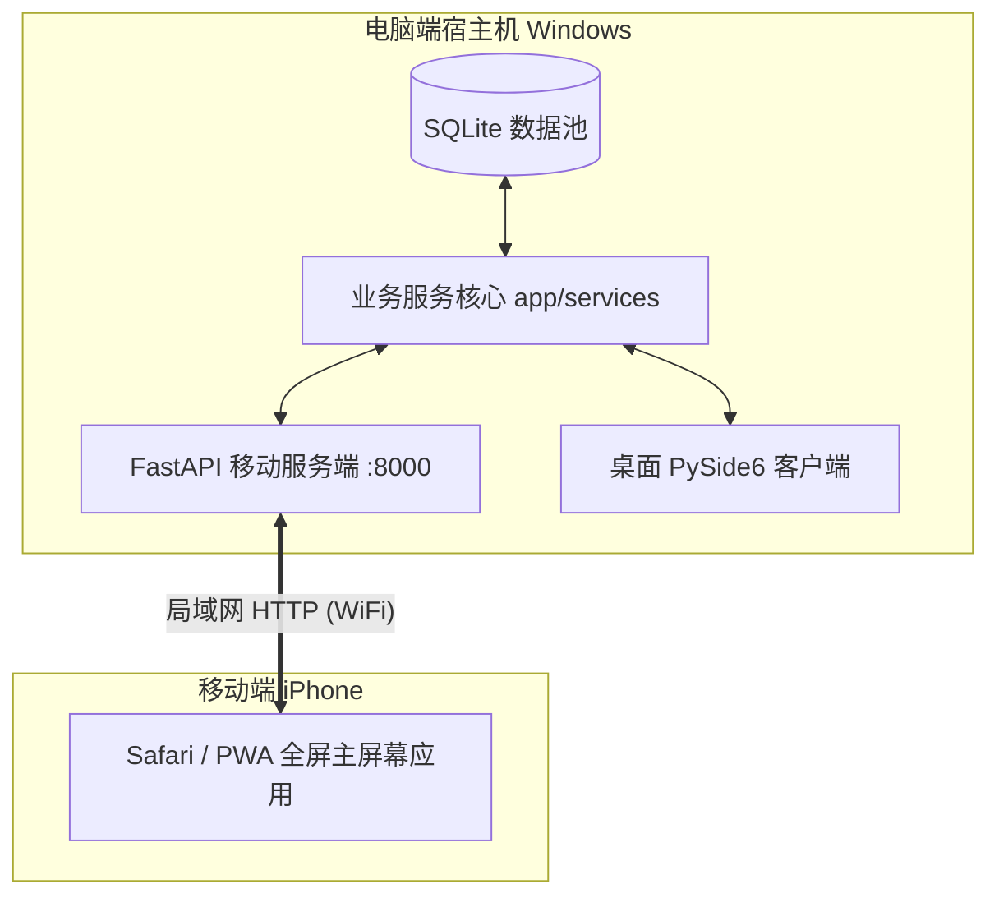

# 股票智能分析软件 — 最终架构设计与技术规格书

> 版本：v1.1 (Brainstorming Validated)  
> 日期：2026-09-20  
> 运行平台：Windows 10/11, macOS 12+ (跨平台桌面)  
> 技术底座：PySide6 (Qt) + PyQtGraph + SQLite + PyInstaller  
> 核心价值：本地多因子量化筛选与大语言模型（LLM）深度可解释性推理深度融合

---

## 1. 需求与边界定义 (Understanding Summary)

### 1.1 产品定位与目标用户
- **目标用户**：个人投资者、偏好结合量化指标与基本面定性分析的进阶投资者。
- **产品定位**：本地优先（Local-First）的股票智能分析与决策辅助桌面软件。
- **合规界限（明确非目标）**：
  - **不提供实盘自动化交易执行与交易接口下单**；
  - **不输出绝对买卖点预测或收益保证**；
  - 全流程强制提供清晰的数据依据溯源与投资风险免责声明。

### 1.2 核心业务边界
1. **标的覆盖**：以 A 股全市场（5000+ 只）为基础底池，同时提供支持多分组、多标签与价格监控的“自定义自选股池”。
2. **筛选与推荐机制（混合全功能）**：
   - **两阶段漏斗推荐**：先通过本地指标过滤至 20~50 只候选池，再由 LLM 进行深度多维定性分析、置信度打分并生成推荐理由。
   - **自然语言筛选 (NL-to-Filter)**：支持任意自然语言输入，由 LLM 解析为结构化筛选因子在本地执行过滤。
   - **单股深度诊断与问答**：支持单股一键生成多维研报（技术/基本/资金/舆情面），提供多轮流式对话问答。
3. **大模型接入（混合模式）**：
   - 默认支持用户自带 Key (BYOK)，兼容 OpenAI 标准协议接口（DeepSeek、通义千问、Kimi、GLM）及本地 Ollama；
   - 架构抽象统一网络中枢，预留官方代理/中心化中转服务的扩展能力。
4. **数据源与同步**：
   - 轻量在线即时拉取 + 本地短期缓存策略（基于 AkShare / 东方财富接口）；
   - 全市场股票表与基础日线指标异步缓存于本地 SQLite，单股详情按需拉取高精数据。

---

## 2. 决策日志 (Decision Log)

| 决策项 | 选定方案 | 备选方案 | 决策依据与权衡 |
| :--- | :--- | :--- | :--- |
| **GUI 与渲染技术** | **PySide6 + PyQtGraph** | Flet / QWebEngineView + ECharts | 原生 C++ 绘图管道带来 60 FPS 流畅 K 线交互，无 Chromium 内存与体积开销，PyInstaller 打包体积小（80~120MB）且无白屏隐患。 |
| **股票标的池范围** | **A 股全市场 + 自定义自选池** | 仅沪深 300 / 跨市场美股港股 | 兼顾全市场选股视野与个人针对性监控，通过本地矩阵计算解决 5000+ 只股票计算开销。 |
| **智能筛选工作流** | **混合全功能（两阶段漏斗 + NL2Filter）** | 纯规则筛选 / 纯定性问答 | 兼顾自动化大模型推理推荐的高价值与自然语言便捷查询的灵活性。 |
| **LLM 接入形态** | **BYOK 混合模式** | 纯中心化代理 / 纯本地模型 | 零服务器运营负担，保障用户隐私安全，同时预留未来商业化与统一云端配置的能力。 |
| **大模型配置测试验证** | **全功能体检 + 交互式控制台 (B+C)** | 仅简单握手探测 (A) | 兼顾网络延迟、流式传输与 JSON 格式三维硬性指标检验，并通过微型交互控制台提供首字延迟体验。 |
| **数据同步策略** | **轻量抓取 + 本地 SQLite 缓存** | 强依赖 Tushare Token / 全量实时全表拉取 | 降低普通用户配置门槛，避免高频请求触发接口反爬限流，保障离线与弱网下的基本可用性。 |

---

## 3. 总体系统架构 (System Architecture)

```
┌──────────────────────────────────────────────────────────────────────────┐
│                           PySide6 桌面表现层                              │
│  [大盘看板]   [自选股池]   [智能筛选器]   [推荐看板]   [个股详情&AI报告]  [系统设置]  │
│                                                                          │
│  自定义金融控件: StockChartWidget (基于 PyQtGraph 绘制蜡烛图/均线/成交量/十字光标) │
└────────────────────────────────────┬─────────────────────────────────────┘
                                     │ Qt 信号与槽 (Signals & Slots)
┌────────────────────────────────────▼─────────────────────────────────────┐
│                       并发调度总线 (QThreadPool)                          │
│        WorkerRunnable (异步执行抓取、量化计算与 LLM 流式通信，杜绝 UI 冻结)       │
└──────┬─────────────────────────────┼─────────────────────────────┬───────┘
       │                             │                             │
┌──────▼──────┐               ┌──────▼──────┐               ┌──────▼──────┐
│  数据服务层  │               │   AI 服务层  │               │  本地持久化  │
│ DataService │               │  LLMService │               │ SQLite DB   │
│             │               │             │               │             │
│ - 行情拉取器 │               │ - 统一 Client│               │ - 股票基础表│
│ - 指标计算器 │               │ - Prompt 模板│               │ - 自选股分组│
│   (Pandas)  │               │ - 流式生成器 │               │ - 策略与历史│
└──────┬──────┘               └──────┬──────┘               └──────┬──────┘
       │                             │                             │
       ▼                             ▼                             ▼
  AkShare / 公开 API             大模型 API 服务              本地系统加密存储
  (东方财富/新浪行情)           (DeepSeek/Qwen/OpenAI/Ollama)    (platformdirs)
```

---

## 4. 详细模块设计与目录结构

```text
stock_ai_app/
├── app/
│   ├── core/                  # 基础设施层
│   │   ├── config.py          # 运行时配置、平台路径与默认参数
│   │   ├── database.py        # SQLite 连接池与 SQLAlchemy ORM 定义
│   │   └── security.py        # 本地 API Key 加解密与安全凭据管理
│   ├── data/                  # 数据采集与处理
│   │   ├── fetcher.py         # 基于 AkShare 的行情、财务与资讯异步拉取器
│   │   ├── indicators.py      # Pandas 向量化技术指标计算（MA/MACD/KDJ/BOLL）
│   │   └── cache_manager.py   # 数据过期策略与 SQLite 增量同步管理
│   ├── ai/                    # 大模型交互
│   │   ├── llm_client.py      # OpenAI 协议兼容客户端封装（支持流式 Token 回调）
│   │   ├── prompts.py         # 研报生成、NL2Filter 结构化输出、打分推荐模板
│   │   └── parser.py          # LLM 结构化输出正则容错与 Pydantic 校验器
│   ├── services/              # 业务服务中枢（纯逻辑，解耦 UI）
│   │   ├── data_service.py    # 行情聚合服务
│   │   ├── screener_service.py# 两阶段漏斗筛选与规则执行引擎
│   │   ├── recommend_service.py# 推荐算法逻辑与归因汇总
│   │   └── watchlist_service.py# 自选股增删改查与实时联动
│   └── ui/                    # 表现层 (PySide6)
│       ├── main_window.py     # 主界面框架、响应式侧边栏导航与状态栏
│       ├── theme.py           # 现代暗色 QSS 样式表注入与主题配色系统
│       ├── components/        # 核心金融组件
│       │   ├── chart_widget.py# PyQtGraph 封装的股票 K 线分时与指标图表
│       │   ├── stat_card.py   # 数据看板卡片与涨跌幅标签
│       │   └── loading.py     # 优雅的异步加载与骨架占位态
│       └── pages/             # 视图页面
│           ├── dashboard.py   # 全市场大盘概览与行业板块热度
│           ├── watchlist.py   # 自选股票池与监控网格
│           ├── screener.py    # 自然语言与多因子组合筛选器
│           ├── stock_detail.py# 单股详情看板、技术图表与 AI 深度诊断报告
│           ├── recommend.py   # 智能推荐卡片流（带理由与风险标记）
│           └── settings.py    # 模型服务商切换、API Key 配置与数据缓存管理
├── assets/                    # 图标（ico/icns）与静态资源
├── main.py                    # 应用程序启动入口
└── build_spec/                # PyInstaller 规格文件与构建脚本
```

---

## 5. 跨平台打包与发布方案 (PyInstaller)

1. **资源与路径标准**：
   - 统一使用 `platformdirs` 确定数据库与用户配置文件存储位置（Windows: `%APPDATA%/StockAI`；macOS: `~/Library/Application Support/StockAI`）；
   - 使用 `sys._MEIPASS` 安全加载打包内嵌的 QSS 与静态图标。
2. **PyInstaller 构建规范**：
   - 采用 `--windowed` 无控制台启动；
   - 显式配置 `hiddenimports`，确保 `pyqtgraph`、`pandas`、`pydantic` 等动态依赖完整装载；
   - 剔除未使用的 Qt 模块（如 `QtWebEngine`、`QtQuick`、`Qt3D`），大幅缩减打包体积与启动耗时。

---

---

## 6. 虚拟操盘秒开性能优化架构 (Virtual Trading Zero-Latency Architecture)

> 验证日期：2026-09-20 (Brainstorming Validated)  
> 选定方案：方案 A（轻量定向行情通道 + QThread 异步刷新管道）

### 6.1 根因与优化目标
- **旧架构瓶颈**：页面激活时在 Qt UI 线程同步全量拉取 5,565 支标的行情并遍历，阻塞主事件循环导致界面假死。
- **优化目标**：首屏加载由数秒降至 $< 30$ ms（0 延迟秒开），后台定向刷新耗时 $< 200$ ms，主线程保持 60 FPS 且无卡顿。

### 6.2 模块职责与分层设计
1. **数据采集层 ([app/data/fetcher.py](file:///d:/AI/stockAnalasis/app/data/fetcher.py))**：
   - 新增 `fetch_specific_quotes(symbols: List[str]) -> Dict[str, Dict[str, Any]]`，单次 HTTP 直连腾讯极速盘口（如 `q=s_sh600519,s_sz000001`），定向拉取持仓标的行情。
2. **业务交易层 ([app/services/trading_service.py](file:///d:/AI/stockAnalasis/app/services/trading_service.py))**：
   - 改造 `refresh_positions_quotes()`，默认仅定向更新持仓列表标的，杜绝全市场 5,565 支标的全量拉取与遍历。
3. **表现层异步流水线 ([app/ui/pages/virtual_trading.py](file:///d:/AI/stockAnalasis/app/ui/pages/virtual_trading.py))**：
   - **双阶段渲染**：
     - **第一阶段（进入即刻 0 延迟）**：立即基于本地 SQLite 渲染资产卡片、持仓列表、流水与图表；
     - **第二阶段（后台静默）**：由 `PositionsQuoteWorker(QThread)` 异步定向拉取持仓最新价，拉取完毕通过 Qt Signal 安全更新主线程界面。

---

## 7. 软件版本管理与发布规范 (Semantic Versioning & Release Management)

为保障客户端软件迭代的高可靠性、可追溯性以及团队协作一致性，本项目严格执行以下版本管理与发版规范：

### 7.1 语义化版本号标准 (SemVer 2.0.0)
应用版本号遵循 `v<MAJOR>.<MINOR>.<PATCH>` 标准格式（例如 `v1.0.0`）：
1. **MAJOR（主版本号）**：
   - 触发条件：进行架构级重大重构、数据存储底层协议不兼容升级或客户端整体交互范式重构。
   - 示例：从单机本地版升级至支持云端协同账户体系。
2. **MINOR（次版本号）**：
   - 触发条件：新增向下兼容的核心功能模块、重大交互体验增强（如引入全新 AI 分析模型提供商、虚拟操盘 0 延迟管道重构、下单弹窗自选股快捷联动）。
   - 示例：`v1.0.0` -> `v1.1.0`。
3. **PATCH（修订号）**：
   - 触发条件：向下兼容的问题修复、样式与视觉缺陷调整（如深色模式对比度调优、表格操作列按钮文本挤压修复）、依赖安全修补。
   - 示例：`v1.0.0` -> `v1.0.1`。

### 7.2 单一可信数据源机制 (Single Source of Truth, SSOT)
- **代码唯一基准**：应用版本号由 [`app/core/config.py`](file:///d:/AI/stockAnalasis/app/core/config.py) 中的 `APP_VERSION` 常量统一定义与维护。
- **全链路消费**：
  - 侧边栏/主窗口：展示 `智能分析终端 v{APP_VERSION}`；
  - 打包分发脚本：[`stock_ai.spec`](file:///d:/AI/stockAnalasis/stock_ai.spec) 读取配置作为分发二进制元数据；
  - 运行日志与上报：所有初始化与诊断日志严格关联当前版本号。
- **杜绝硬编码**：禁止在各页面或业务模块中私自硬编码版本文本。

### 7.3 更新日志规范 (Keep a Changelog)
- 项目根目录下强制维护 [`CHANGELOG.md`](file:///d:/AI/stockAnalasis/CHANGELOG.md)。
- 每次版本发布均须按照标准分类归档：
  - `Added`：新功能或新交互能力；
  - `Changed`：对现有功能的调整与增强；
  - `Fixed`：缺陷与异常修复；
  - `Performance`：性能优化与内存、首屏延迟改进；
  - `Security`：安全与凭据保护升级。

### 7.4 Git Tag 标签与发布流水线 (Release Workflow)
1. **主干稳定合并**：所有特性与修复合并至 `main` 分支，且必须通过全量自动化单元测试。
2. **版本号与日志对齐**：递增 `app/core/config.py` 中的 `APP_VERSION`，并在 `CHANGELOG.md` 中完备记录本次变更明细。
3. **创建带注释 Git 标签**：
   ```bash
   git tag -a v<MAJOR>.<MINOR>.<PATCH> -m "Release v<MAJOR>.<MINOR>.<PATCH>: <发布概要说明>"
   ```
4. **远程同步与发布归档**：
   ```bash
   git push origin main
   git push origin v<MAJOR>.<MINOR>.<PATCH>
   ```
5. **二进制构建发布**：基于该 Tag 触发 PyInstaller 自动化构建，生成独立跨平台可执行分发包并上传至 GitHub Releases。

---

## 8. iPhone 移动端适配与 PWA 架构设计 (Mobile Web & PWA Architecture)

> 验证日期：2026-09-20 (Brainstorming Validated)  
> 选定方案：方案 A（FastAPI 嵌入式服务 + 移动端响应式 PWA）

### 8.1 需求总结与设计边界 (Understanding Summary)
- **核心诉求**：实现 iPhone 上顺畅使用 StockAI 的股票大盘监控、自选股池、AI 深度研判与虚拟操盘功能。
- **形态选定**：采用 **B/S 架构 + iOS PWA（添加到主屏幕）** 路线，无需繁琐的 Sideloadly 证书签名续签流程，手机侧获得独立桌面图标、无浏览器工具栏的全屏沉浸体验。
- **算力分工**：Python 数据采集（AkShare）、量化因子分析、大模型推理与 SQLite 数据池继续由电脑宿主机承载，手机作为轻量、敏捷的交互展示终端。
- **网络拓扑**：局域网（Wi-Fi）直连模式，电脑开放局域网 HTTP 端口，手机直接通过内网 IP 访问。
- **明确非目标 (Non-Goals)**：
  - 现阶段不编译 iOS 原生二进制 `.ipa` 包，避免 7 天签名掉签与复杂的交叉编译链；
  - 现阶段不配置公网内网穿透与公网暴露，专注局域网内极致低延迟体验。

### 8.2 核心假设 (Assumptions)
1. **移动端单手交互适配**：采用深色金融主题单页架构（SPA），底部固定 4 项 Tab 导航，支持移动端自适应流式卡片与触摸缩放交互。
2. **业务与数据层 100% 复用**：后端接口直接调用现有 `app/services/`（交易、自选、推荐、数据抓取）与 `app/core/config.py`，保持桌面端与移动端数据即时同步。
3. **极简技术栈**：后端选用 FastAPI 提供 REST API 与静态 PWA 托管；前端采用纯原生 HTML5 / CSS3 / JavaScript + ECharts 移动端触控图表，零前端编译构建依赖。

### 8.3 决策日志 (Decision Log)
| 决策项 | 选定方案 | 评估备选项 | 选定原因与权衡 |
| :--- | :--- | :--- | :--- |
| **客户端形态** | iOS PWA (添加到主屏幕) | Sideloadly IPA 侧载 / 原生编译 | 避免免费个人 Apple ID 证书每 7 天掉签需连线电脑重签的严重痛点；PWA 添加到主屏幕后具备同等独立图标与全屏原生体验。 |
| **架构选型** | 方案 A：FastAPI 嵌入式服务 | 方案 B：前后端分离工程 (Vite + Vue3) | 方案 A 单文件 Python 驱动，无额外 Node.js/npm 构建链负担，开发与维护成本最低。 |
| **网络场景** | 局域网 Wi-Fi 直连 | 公网穿透 (Cloudflare/FRP) | 专注家庭与办公环境，配置零门槛，数据安全且内网延迟极低。 |
| **启动模式** | 独立脚本 + 桌面端开关双模 | 仅命令行独立进程 | 既支持无 GUI 静默运行，也支持在桌面客户端设置中一键勾选启动。 |

### 8.4 详细系统架构与模块设计 (System Architecture)



### 8.5 独立全景大盘与拼音首字母搜索设计 (Overview & Pinyin Search)

> 验证日期：2026-09-20 (Brainstorming Validated)  
> 选定方案：方案 A（轻量拼音索引预取 + 纯前端零延迟内存检索 + 移动端 5-Tab 榜单架构）

#### 1. 拼音首字母毫秒级联想架构
- **轻量索引接口**：服务端暴露 `GET /api/stock/search-index`，预生成并缓存全市场 5,500+ 标的的精简三元组：
  ```json
  [
    { "s": "000001", "n": "平安银行", "p": "PAYH" },
    { "s": "600519", "n": "贵州茅台", "p": "GZMT" }
  ]
  ```
  数据体量仅约 80 KB（Gzip 压缩后 $< 25$ KB），移动端首次载入时静默预加载并缓存至 JavaScript 内存中。
- **纯前端零延迟匹配**：用户在搜索框键入拼音缩写（如 `PAYH`、`payh`）、6 位代码或中文时，纯前端直接在内存中执行前缀与包含匹配，计算耗时 $< 2$ ms，彻底杜绝网络请求往返造成的卡顿。
- **悬浮联想面板**：输入即时弹出浮动列表（展示前 8 条匹配项），直观呈现代码、名称、现价与涨跌幅，并内嵌【⭐ 加自选】与【🔍 研判】快捷触控入口。

#### 2. 全景大盘独立 Tab 与多因子排行榜
- **导航扩展为 5 大 Tab**：
  1. 🌐 **【全景大盘】**：四大宽基指数网格、全市场多空涨跌统计条、多因子排行榜流式卡片；
  2. ⭐ **【我的自选】**：专属自选股票池、分组切换、实时报价监控与一键移除；
  3. 🎯 **【精选推荐】**：两阶段量化与大模型综合评级推荐卡片流；
  4. 🔍 **【个股研判】**：自选下拉切换、50 日 Canvas 交互 K 线、量化指标快照与研报；
  5. 💼 **【虚拟操盘】**：总资产看板、持仓浮盈明细、一键平仓与模拟买入悬浮抽屉。
- **4 大精排子榜单**：
  - 【🔥 今日涨幅榜】、【🧊 今日跌幅榜】、【💰 成交额榜】、【⚡ 换手率榜】；
  - 服务端提供 `GET /api/market/rankings?category=gainers|losers|volume|turnover&limit=50`，基于内存全市场 DataFrame 极速切片；
  - 移动端单手滚动顺滑维持 60 FPS，点击卡片直接穿透至【个股研判】。

---

*文档状态：正式设计基准，已包含全景大盘看板与拼音首字母模糊查询架构规范。*